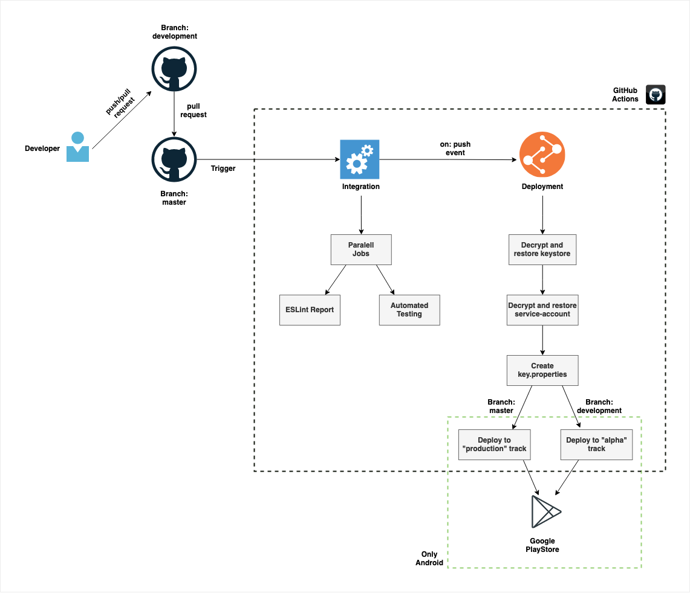

# FaceTheFacts React Native App

[Face The Facts](https://facethefacts.app/) is an open-source project that develops a mobile app to show politicians' information by scanning their election posters with a smartphone. Our mission is to make politicians' information (e.g., their past voting behaviours and CVs) more accessible and to encourage users to vote critically.
In our project, we focus on the German election system. With our architecture, you can build a Face The Facts app for a different country.
This repository includes the code for the mobile applications (IOS/Android) using the React-Native framework. For the provision of the data, please have a look on the [backend repository](https://github.com/FaceTheFacts/backend).

## Installation/ Run locally

React Native is using NPM for package management. Please make sure to [install the cli](https://docs.npmjs.com/about-npm-versions) before continuing.

1. Clone the project to your local machine
2. Navigate to the root folder of the project on your command line/terminal
3. `npm install`
4. [Follow the tutorial by React Native for your environment](https://reactnative.dev/docs/0.65/environment-setup) (make sure to select the tab `React Native CLI Quickstart`)
5. The app should be running now 🎉

## Continuous Integration/Deployment
This repository includes an automatic CI/CD pipeline for checking the respective push/pull-request event and in case of code is merged or pushed into the `master` or `development` branches, it project will be automatically build and published to the Google PlayStore using Fastlane. For the `development` branch it will go to the `alpha` testing track and for `master` to the `production` track. Note that the update needs to be confirmed by a FaceTheFacts core-maintainer before going live. A ruff overview of this flow can be found in the diagram below:

The automatic deployment for IOS will follow.
